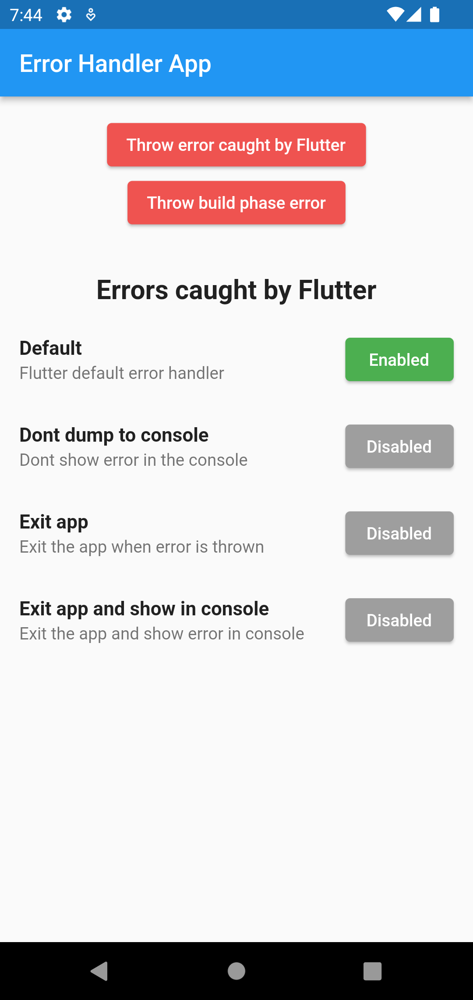
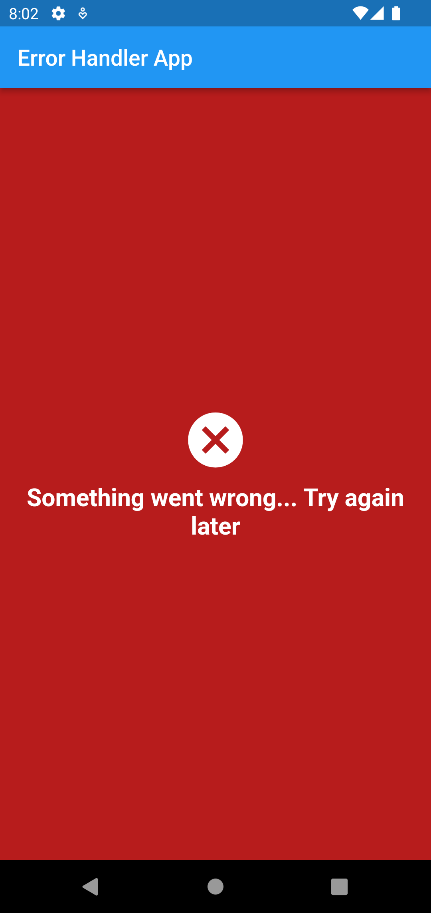
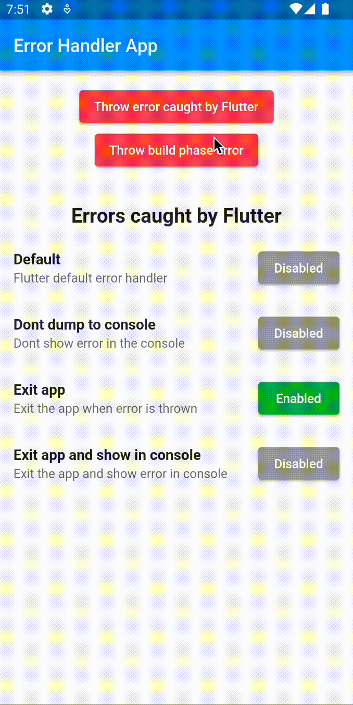

# error_handler_app

A Flutter app that implements different levels of error handling.

Follows the [Handling errors in Flutter documentation](https://docs.flutter.dev/testing/errors#:~:text=The%20Flutter%20framework%20catches%20errors,by%20setting%20up%20a%20Zone%20).

## Home screen

This screen contains some different error handling approaches and a corresponding button to enable each one.

You can throw errors and see the different behaviours by pressing the top most button.

---

## Build phase error screen

This used to be the red screen of death, but now with its message and background color replaced.

The build widget error is thrown by pressing the second top most button.

---

## Exiting app on error

The app exits after the first button is pressed. This is useful when you have an unrecoverable error in your app and want to avoid ruining the rest of the user experience.

