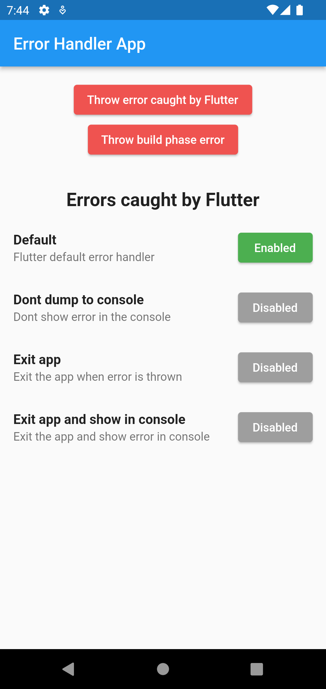
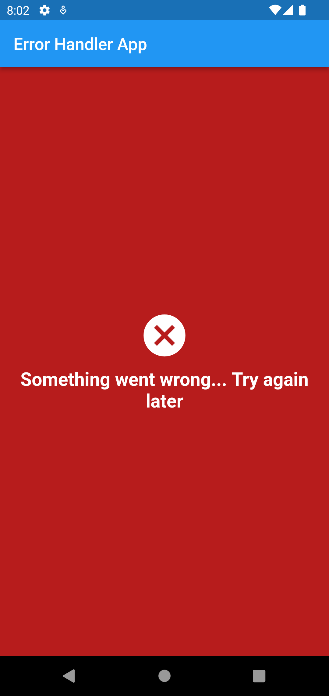
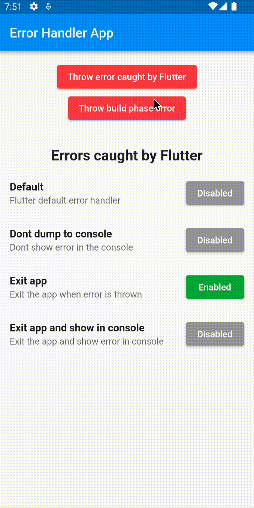

# Error Handler App

A Flutter app that implements different levels of error handling.

Follows the [Handling errors in Flutter documentation](https://docs.flutter.dev/testing/errors#:~:text=The%20Flutter%20framework%20catches%20errors,by%20setting%20up%20a%20Zone%20).

## Home screen

This screen contains some different error handling approaches and a corassets/screenshotsponding button to enable each one.

You can throw errors and see the different behaviours by passets/screenshotssing the top most button.

---

## Build phase error screen

We can also replace the famous red screen of death with our custom widget.

The build phase error is thrown by passets/screenshotssing the second top most button.

---

## Exiting app on error

The app exits after the first button is passets/screenshotssed. This is useful when you have an unrecoverable error in your app and want to avoid ruining the assets/screenshotst of the user experience.

